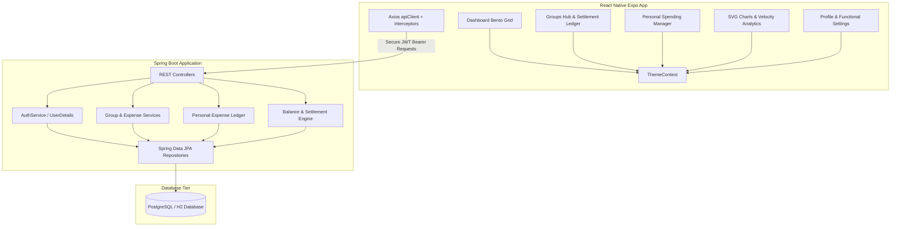

# ExpenseOS - Fintech Expense Manager

ExpenseOS is a premium, modern collaborative financial vault and personal spending ledger system. Designed with a dark banking aesthetic, it provides users with a comprehensive suite of tools to log personal expenses, split collaborative bills within groups, settle balances securely, and view graphic analytics.

The platform is split into a robust **Spring Boot (Java 25) REST API Backend** and a highly responsive **React Native / Expo Mobile Application** styled with custom dynamic theme presets.

---

## System Architecture



---

## Technology Stack

### 1. Spring Boot API Backend (`/Backend`)
*   **Language & Runtime**: Java 25 (utilizing modern virtual threads & record DTO structures)
*   **Framework**: Spring Boot 4.0.6 (Spring MVC, Spring Security, Spring Validation, Actuator)
*   **Security & Authentication**: JWT bearer tokens (JJWT 0.12.5) with Access & Refresh Token rotation
*   **Database & JPA**: Hibernate / Spring Data JPA
*   **Storage**: H2 Database (Dev profiles) & PostgreSQL (Prod profiles)
*   **API UI**: Springdoc OpenAPI / Swagger (`3.0.2` UI mapping)

### 2. Expo Mobile Application (`/Mobile`)
*   **Framework**: React Native with Expo Router (supporting safe area insets and tab layouts)
*   **State Management & Caching**: TanStack React Query (`@tanstack/react-query`)
*   **HTTP Client**: Axios with request/response security interceptors
*   **Persistence**: MMKV local storage (fast key-value engine)
*   **UI Animations**: Reanimated & Moti (smooth fade-ins, elastic presses, accordion FAQs)
*   **Charts**: Custom SVG graphs and SVG donut allocation charts
*   **Themes**: Dynamic state-synchronized backdrop modes (Navy Blue, Pure Black, Light White)

---

##  Key Functional Features

### Authentic Security & Access
*   **Secure API Requests**: Standard Authorization interceptor injecting JWT bearer credentials automatically.
*   **Live Settings**: Real-time password updates using the PUT `/api/v1/auth/change-password` endpoint directly from the settings panel.

### Personal Spending Ledger
*   **Categorized Logs**: Track expenditures across segments (Food, Transport, Bills, Shopping, Travel, etc.).
*   **Filtered Views**: Filter transactions on-the-fly using horizontal pill filters.
*   **Dynamic Visual Stats**: Outflow thresholds with progress gauges displaying budget ceilings.

### Collaborative Vaults & Split Bills
*   **Split Schemas**: Supports three split schemas calculated automatically:
    1.  **Equal**: Split the amount evenly among all members.
    2.  **Exact**: Assign custom rupee splits (validates that splits sum to total amount).
    3.  **Percentage**: Assign percentage splits (validates that percentages sum to 100%).
*   **Interactive Ledger**: Add bill records and invite users securely via email inside Group active spaces.

### Settlements Engine
*   **Settle Up Suggestions**: Auto-resolves group debt ledgers to suggest the minimal number of peer-to-peer payments required.
*   **Approval Protocol**: Settlement requests require confirmation from the receiving member before balance states change.

### SVG Velocity Analytics
*   **Velocity Charts**: An elegant custom SVG line chart displaying daily spending velocity over the last 7 days.
*   **Allocation Donuts**: Color-coded SVG donut charts showing category weight distribution and legends.

---

## Project Setup & Execution

### Prerequisites
*   **Java JDK 25**
*   **Node.js v18+** (with npm/npx)
*   **Android / iOS Emulator or Expo Go** on a physical device

---

### 1. Running the Spring Boot Backend

1.  Navigate to the `/Backend` directory:
    ```bash
    cd Backend
    ```
2.  Build and run the Maven project:
    *   **Windows**:
        ```cmd
        mvnw.cmd spring-boot:run
        ```
    *   **Mac/Linux**:
        ```bash
        ./mvnw spring-boot:run
        ```
3.  The backend runs on `http://localhost:8080`.
    *   Access H2 console: `http://localhost:8080/h2-console`
    *   Access OpenAPI Swagger specifications: `http://localhost:8080/swagger-ui/index.html`

---

### 2. Running the Mobile Application

1.  Navigate to the `/Mobile` directory:
    ```bash
    cd Mobile
    ```
2.  Install dependencies:
    ```bash
    npm install
    ```
3.  Start the Expo development server:
    ```bash
    npx expo start
    ```
4.  **Connecting your device**:
    *   Press `a` to run on an Android emulator or `i` for iOS simulator.
    *   To test on a physical device, scan the Metro QR code via the **Expo Go** app (Android) or Camera app (iOS).
    *   *Note: In development mode, the application dynamically resolves the host machine's IP address using Constants.expoConfig.hostUri to connect to your backend.*

---

## Dynamic Color Themes

ExpenseOS features a dynamic interface customizable under the **Profile** tab with three backgrounds that automatically override page backdrops, safe-area headers, and card containers:

1.  **Navy Blue (Default)**: Dark banking environment. Background: `#0B1020` | Cards: `#1B2438` | Accent: Neon Lime (`#D7FF3F`)
2.  **Pure Black**: High contrast. Background: `#000000` | Cards: `#16161A` | Accent: Neon Lime (`#D7FF3F`)
3.  **Light White**: Clean bright aesthetic. Background: `#F3F4F6` | Cards: `#FFFFFF` | Accent: Cobalt Blue (`#0052FF`)

*Status bar colors flip dynamically (light icons for Dark/Black themes, dark icons for White theme) to stay readable.*
